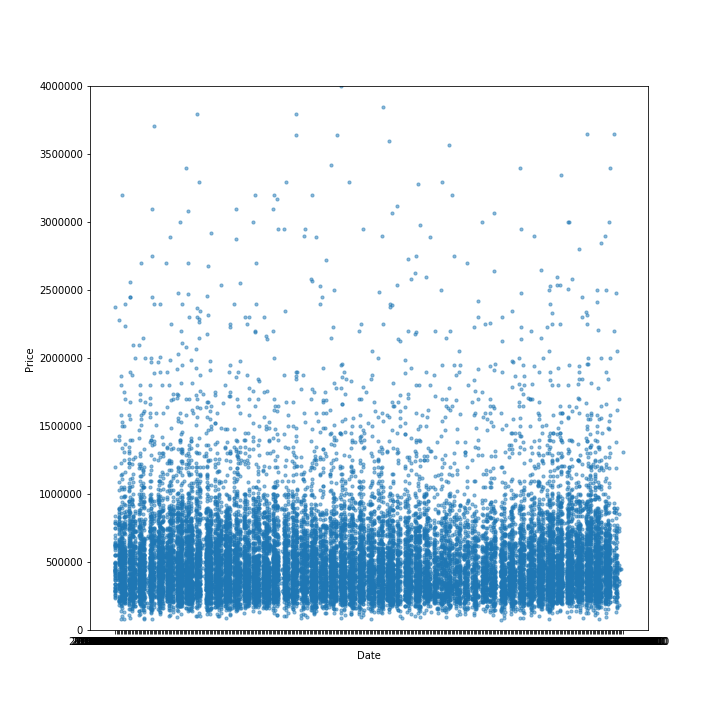
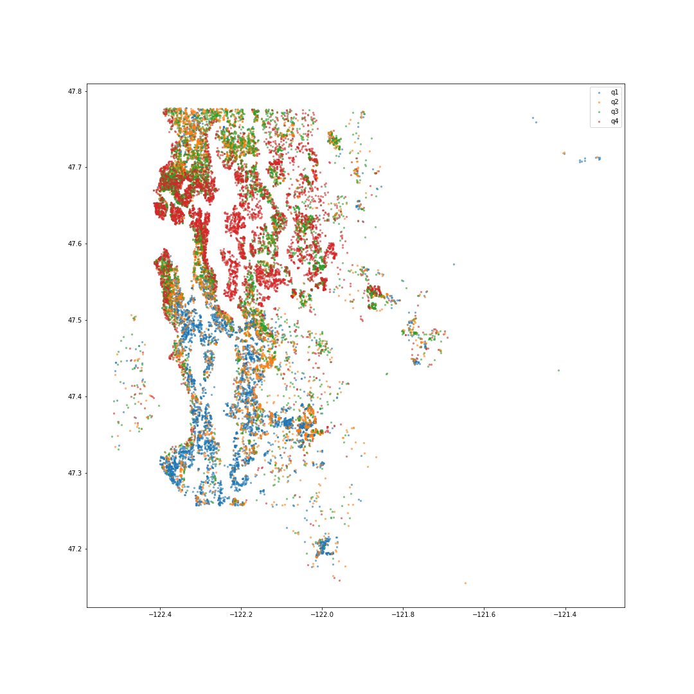
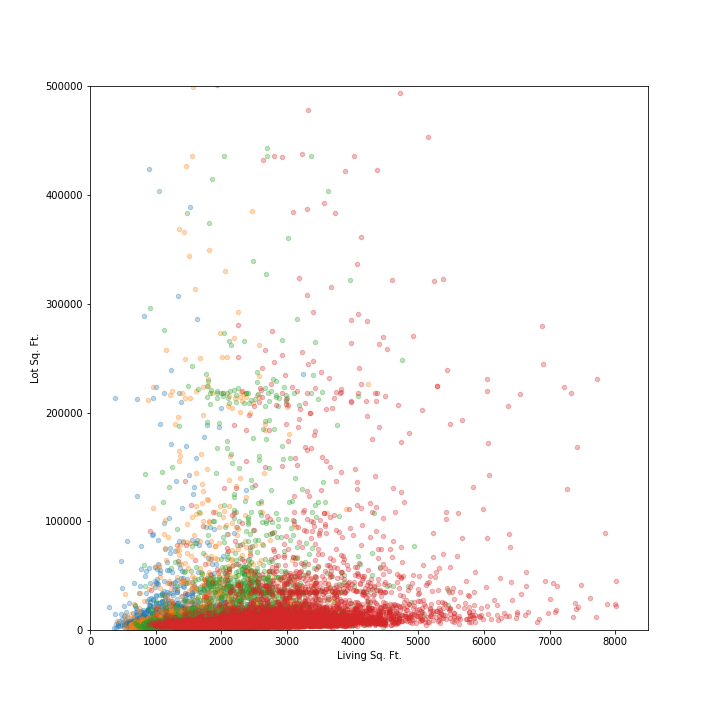
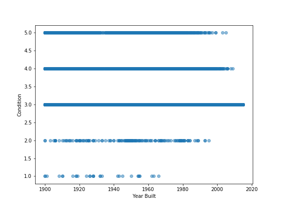
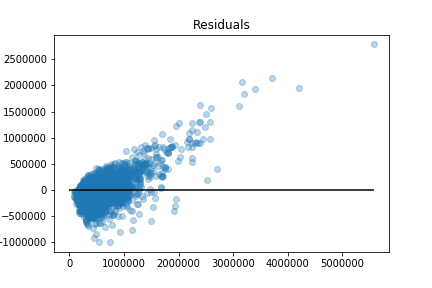
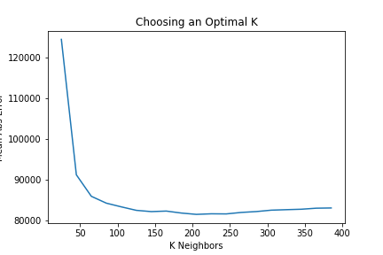
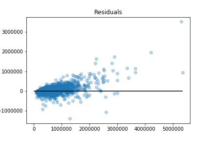

### Predicting Housing Prices in King County (Seattle)

## Initial Data Exploration
The data is from 2014 to 2015. I first wanted to see if time would be a factor in the analysis. 
There doesn't seem to be a trend or seasonality in home prices. 
I still split training data and test data based on time in order to combat time leakage. 

The most important factor in real estate is location. The following displays house sale locations color mapped into quartiles. The highest priced houses (in red) tend to be in distinct neighborhoods north of the city or downtown. 

Also a high determinant of price involves the house size and property size. 

An interesting relationship was found between the year the house was built and its current condition grade. 
Surprisingly, a majority of the homes built after 2000 are rated a condition of 3, which is average. Among many possible factors, this could be due to cheaper materials being used. 

## Modeling

The initial model built was a simple linear regression, which resulted in a mean absolute error of just over $157,000.
Plotting the residuals shows the model wasn't picking up well on some non-linear relationships in the data, overestimating lower priced houses and underestimating more expensive houses.

To improve, I wanted to only use data from homes sold in nearby locations. I used a K Nearest Neighbors model to find the 200 nearest houses based on latitude and longitude, and then used the data from these houses to train a Random Forest and predict each data point in my test set.
K was chosen by finding the minimum error in a range from 0 to 400.

This resulted in a MAE of $80,326.

